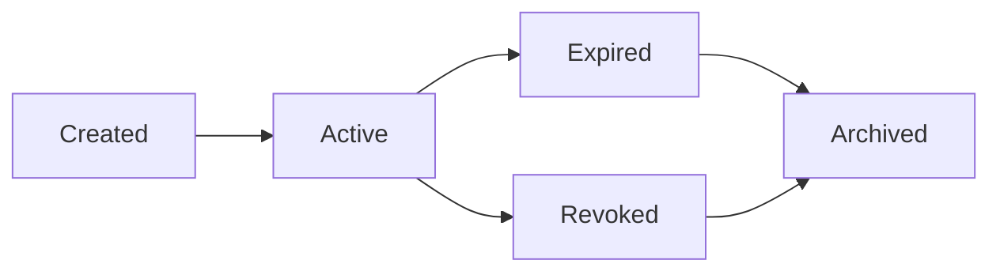

## What are Attestations?

An **attestation** is a verifiable claim made by a trusted entity (authority) about a subject (user, contract, or organization). Think of attestations as on-chain certificates that prove something about an entity.

In the real world, attestations are everywhere:
- A university diploma attests to your education
- A driver's license attests to your driving ability  
- A credit score attests to your financial reliability
- A vaccination record attests to your health status

AttestProtocol brings this concept to Web3, enabling **programmable trust** through verifiable on-chain attestations.

## Core Components

Every attestation consists of five key components:

<CardGroup cols={2}>
  <Card title="Authority" icon="shield-check">
    The trusted entity making the claim (KYC provider, DAO, organization)
  </Card>
  <Card title="Subject" icon="user">
    The entity the claim is about (wallet address, smart contract, etc.)
  </Card>
  <Card title="Schema" icon="database">
    The structure defining what data the attestation contains
  </Card>
  <Card title="Data" icon="file-text">
    The actual claim data (verified: true, score: 85, etc.)
  </Card>
  <Card title="Metadata" icon="tag">
    Additional info like expiration, creation time, revocation status
  </Card>
</CardGroup>

## Attestation Lifecycle

Attestations follow a predictable lifecycle:



### States Explained

<AccordionGroup>
<Accordion title="Created">
The attestation has been issued and recorded on-chain. It's ready to be used for verification.
</Accordion>

<Accordion title="Active">
The attestation is valid and can be used for verification. This is the normal operating state.
</Accordion>

<Accordion title="Expired">
The attestation has passed its expiration date and is no longer valid for verification.
</Accordion>

<Accordion title="Revoked">
The authority has explicitly revoked the attestation, making it invalid regardless of expiration.
</Accordion>

<Accordion title="Archived">
The attestation is kept for historical purposes but is not active.
</Accordion>
</AccordionGroup>

## Types of Attestations

AttestProtocol supports various types of attestations:

### Identity Attestations
Verify who someone is or their credentials:

```javascript
// KYC Verification
{
  schema: 'kyc-basic',
  data: {
    verified: true,
    tier: 'premium',
    verifiedAt: '2024-01-15T10:30:00Z'
  }
}

// Professional Credentials
{
  schema: 'certification',
  data: {
    title: 'Certified Smart Contract Auditor',
    issuer: 'Web3 Security Institute',
    validUntil: '2025-01-15'
  }
}
```

### Behavioral Attestations
Attest to actions, achievements, or behavior:

```javascript
// Governance Participation
{
  schema: 'dao-participation',
  data: {
    proposalsVoted: 25,
    participationRate: 0.85,
    lastVote: '2024-01-10T15:45:00Z'
  }
}

// DeFi Activity
{
  schema: 'defi-reputation',
  data: {
    protocolsUsed: ['Uniswap', 'Aave', 'Compound'],
    totalVolume: 50000,
    liquidationHistory: false
  }
}
```

### Relationship Attestations
Attest to relationships between entities:

```javascript
// Employment
{
  schema: 'employment',
  data: {
    employer: 'Acme Corp',
    position: 'Senior Developer',
    startDate: '2023-06-01',
    verified: true
  }
}

// DAO Membership
{
  schema: 'dao-membership',
  data: {
    dao: 'CryptoDevs DAO',
    memberSince: '2023-01-01',
    role: 'contributor',
    reputation: 95
  }
}
```

## Attestation Properties

### Immutability
Once created, the core attestation data cannot be changed. This ensures trust and prevents tampering.

### Verifiability
Anyone can verify an attestation's authenticity using cryptographic proofs without revealing sensitive data.

### Composability
Attestations can reference other attestations, creating complex trust networks:

```javascript
// This attestation references another
{
  schema: 'advanced-kyc',
  data: {
    basicKycId: 'att_123abc',  // References basic KYC
    additionalChecks: ['sanctions', 'pep'],
    riskScore: 'low'
  }
}
```

### Programmability
Smart contracts can automatically verify attestations and make decisions:

```solidity
// Solidity example
if (attestProtocol.verify(user, "kyc-basic")) {
    // Allow high-value transaction
    processTransaction(amount);
}
```

## Working with Attestations

### Creating Attestations

```javascript
const attestation = await client.attest({
  schema: 'user-verification',
  subject: userAddress,
  data: {
    verified: true,
    method: 'government-id',
    country: 'US'
  },
  expiresAt: new Date('2025-01-01'),
  metadata: {
    tags: ['kyc', 'identity'],
    confidenceScore: 95
  }
});
```

### Verifying Attestations

```javascript
// Simple boolean check
const isVerified = await client.verify({
  subject: userAddress,
  schema: 'user-verification'
});

// Get detailed data
const attestations = await client.getAttestations({
  subject: userAddress,
  schema: 'user-verification',
  status: 'active'
});
```

### Revoking Attestations

```javascript
await client.revoke({
  attestationId: 'att_123abc',
  reason: 'User requested deletion'
});
```

## Trust Models

AttestProtocol supports different trust models:

### Single Authority
One trusted entity issues attestations:
```
University → Diploma Attestation → Student
```

### Multi-Authority
Multiple entities must agree:
```
Bank + KYC Provider + Government → High-Trust Attestation → User
```

### Web of Trust
Entities attest to each other:
```
User A ← Trusts → User B ← Trusts → User C
```

### Delegated Authority
Authorities can delegate attestation power:
```
Root Authority → Regional Authority → Local Verifier → User
```

## Privacy Considerations

AttestProtocol supports various privacy models:

### Public Attestations
Full data is visible on-chain:
```javascript
{
  verified: true,
  score: 85,
  country: 'US'
}
```

### Private Attestations
Only hashes are stored on-chain:
```javascript
{
  dataHash: '0xabc123...',
  verified: true  // Only boolean result
}
```

### Zero-Knowledge Attestations
Prove claims without revealing data:
```javascript
{
  ageOver18: true,  // Without revealing actual age
  hasCleanRecord: true  // Without revealing specifics
}
```

## Best Practices

<AccordionGroup>
<Accordion title="Schema Design">
- Keep schemas simple and focused
- Use semantic field names
- Include version information for evolving schemas
- Document field meanings clearly
</Accordion>

<Accordion title="Data Structure">
- Store minimal necessary data
- Use standard formats (ISO dates, etc.)
- Consider privacy implications
- Plan for schema evolution
</Accordion>

<Accordion title="Expiration Strategy">
- Set appropriate expiration dates
- Consider renewal processes
- Balance security with user experience
- Plan for grace periods
</Accordion>

<Accordion title="Authority Management">
- Implement proper key management
- Use multi-sig for critical authorities
- Plan for authority rotation
- Monitor for compromised keys
</Accordion>
</AccordionGroup>

## Integration Examples

### Authentication Gate
```javascript
async function checkAccess(userAddress) {
  const hasKYC = await client.verify({
    subject: userAddress,
    schema: 'kyc-basic'
  });
  
  const hasGoodReputation = await client.verify({
    subject: userAddress,
    schema: 'reputation-score'
  });
  
  return hasKYC && hasGoodReputation;
}
```

### Dynamic Pricing
```javascript
async function calculateFee(userAddress, baseAmount) {
  const attestations = await client.getAttestations({
    subject: userAddress,
    schema: 'reputation-score'
  });
  
  if (attestations.length > 0) {
    const score = attestations[0].data.score;
    return score > 80 ? baseAmount * 0.5 : baseAmount; // 50% discount for high reputation
  }
  
  return baseAmount;
}
```

### Conditional Logic
```javascript
async function approveTransaction(userAddress, amount) {
  if (amount > 10000) {
    // Require enhanced KYC for large amounts
    return await client.verify({
      subject: userAddress,
      schema: 'kyc-enhanced'
    });
  } else {
    // Basic KYC is sufficient
    return await client.verify({
      subject: userAddress,
      schema: 'kyc-basic'
    });
  }
}
```

## Next Steps

<CardGroup cols={2}>
  <Card
    title="Schemas"
    icon="database"
    href="/concepts/schemas"
  >
    Learn how to design and manage attestation schemas
  </Card>
  <Card
    title="Authorities"
    icon="shield-check"
    href="/concepts/authorities"
  >
    Understand authority models and management
  </Card>
  <Card
    title="TypeScript SDK"
    icon="code"
    href="/sdks/typescript/methods"
  >
    Explore all SDK methods for working with attestations
  </Card>
  <Card
    title="Examples"
    icon="laptop-code"
    href="/examples/kyc-verification"
  >
    See real-world attestation implementations
  </Card>
</CardGroup>