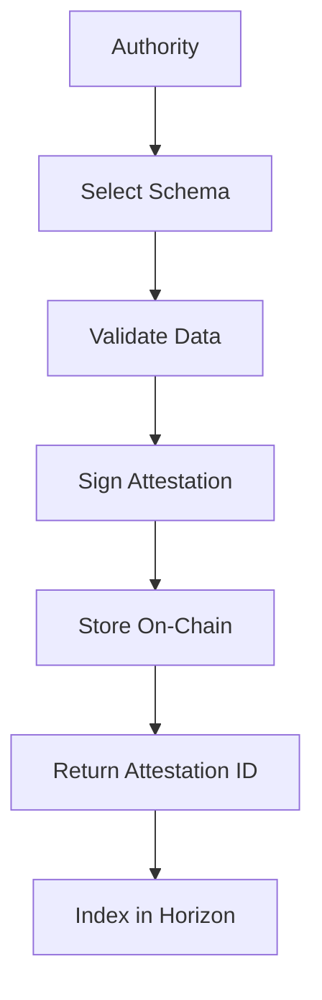
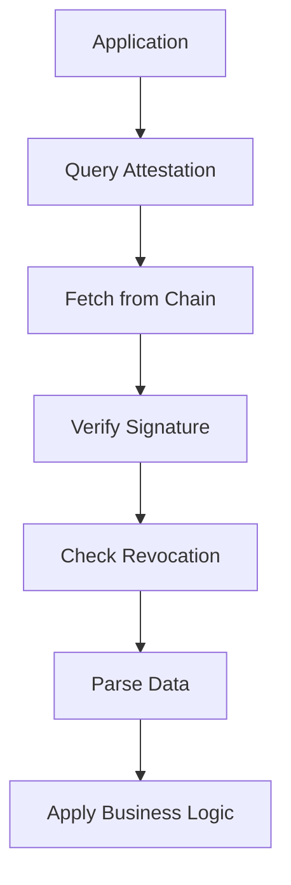

## System Architecture

AttestProtocol operates as a schema-based attestation system where standardized templates define the structure and validation rules for verifiable claims. The architecture ensures consistency across applications while maintaining flexibility for diverse use cases.

---

## Core Components

### Schemas
Schemas serve as the foundational templates that define:
- **Data Structure**: Field names, types, and relationships
- **Validation Rules**: Required fields, format constraints, and value ranges
- **Metadata**: Schema version, description, and usage guidelines
- **Revocability**: Whether attestations can be revoked after creation

**Example Schema Definition:**
```typescript
{
  "name": "kyc-basic",
  "version": "1.0.0",
  "definition": "verified:bool,level:string,score:uint8,timestamp:uint64",
  "revocable": true,
  "description": "Basic KYC verification with compliance level and risk score"
}
```

### Authorities
Authorities are entities authorized to issue attestations under specific schemas. They provide the trust anchor for the attestation system:

**Authority Types:**
- **Individual Authorities**: Personal accounts for individual attestations
- **Organizational Authorities**: Companies and institutions providing verification services
- **DAO Authorities**: Decentralized organizations issuing collective attestations
- **Automated Authorities**: Systems and protocols issuing programmatic attestations

**Authority Registration Process:**
1. Register wallet as authority on-chain
2. Optionally complete verification process for enhanced trust
3. Begin issuing attestations under chosen schemas
4. Build reputation through accurate and reliable attestations

### Attestations
Attestations are cryptographically signed claims that link:
- **Authority**: Who issued the attestation
- **Subject**: Who or what the attestation is about
- **Schema**: The template governing data structure
- **Data**: The actual claim information
- **Metadata**: Timestamps, references, and additional context

---

## Attestation Lifecycle

### 1. Schema Creation or Selection

**Creating New Schema:**
```typescript
const result = await sdk.createSchema({
  schemaName: 'employee-verification',
  schemaContent: 'employed:bool,company:string,role:string,startDate:uint64',
  revocable: true
});
```

**Using Existing Schema:**
```typescript
const schema = await sdk.fetchSchema('kyc-basic-v1');
```

### 2. Authority Registration

**Initial Registration:**
```typescript
const authority = await sdk.registerAuthority();
```

**Verification (Optional):**
- Submit required documentation
- Complete identity verification process
- Receive verified authority status

### 3. Attestation Issuance

**Creating Attestation:**
```typescript
const attestation = await sdk.attest({
  schemaUID: 'kyc-basic-v1',
  subject: userAddress,
  value: 'verified:true,level:enhanced,score:95,timestamp:1704067200',
  reference: 'kyc-session-2024-001'
});
```

### 4. Attestation Verification

**Fetching Attestation:**
```typescript
const result = await sdk.fetchAttestation({
  schemaUID: 'kyc-basic-v1',
  subject: userAddress
});

if (result.data && !result.data.revoked) {
  // Process valid attestation
  const data = parseAttestationData(result.data.value);
  console.log('KYC Level:', data.level);
}
```

### 5. Revocation (Optional)

**Revoking Attestation:**
```typescript
const revocation = await sdk.revokeAttestation({
  schemaUID: 'kyc-basic-v1',
  subject: userAddress,
  reference: 'kyc-session-2024-001'
});
```

---

## Data Flow Architecture

### Attestation Creation Flow



### Verification Flow



---

## Chain-Specific Implementation

### Stellar/Soroban

**Key Features:**
- Contract-based attestation storage
- Transaction hash UIDs for schemas
- Simple string-based data format
- Built-in revocation mechanisms

**Storage Model:**
```typescript
interface StellarAttestation {
  schemaUid: string;      // Schema transaction hash
  subject: string;        // Stellar address
  value: string;          // Comma-separated data
  reference: string;      // Optional reference ID
  revoked: boolean;       // Revocation status
}
```

### Solana/Anchor

**Key Features:**
- Program Derived Address (PDA) management
- Rich metadata and timestamp support
- Token-based levy system for schemas
- Cross-program invocation capabilities

**Storage Model:**
```typescript
interface SolanaAttestation {
  schema: PublicKey;           // Schema PDA
  recipient: PublicKey;        // Subject address
  attester: PublicKey;         // Authority address
  data: string;                // Attestation data
  time: BN;                    // Creation timestamp
  expirationTime: BN;          // Expiration timestamp
  revocationTime: BN;          // Revocation timestamp
  revocable: boolean;          // Revocability flag
}
```

---

## SDK Integration Patterns

### Factory Pattern Implementation

```typescript
// Initialize chain-specific SDK
const stellarSDK = await AttestSDK.initializeStellar({
  secretKeyOrCustomSigner: secretKey,
  publicKey: publicKey,
  url: 'https://soroban-testnet.stellar.org'
});

const solanaSDK = await AttestSDK.initializeSolana({
  walletOrSecretKey: secretKey,
  url: 'https://api.devnet.solana.com'
});
```

### Unified Interface Usage

```typescript
// Same interface across all chains
async function issueAttestation(sdk: AttestSDKBase, config: any) {
  // Check authority status
  const authority = await sdk.fetchAuthority();
  if (authority.error) {
    await sdk.registerAuthority();
  }

  // Issue attestation
  const result = await sdk.attest(config);
  return result;
}
```

---

## Event System Integration

### Real-Time Monitoring

The Horizon indexer provides real-time event monitoring:

```typescript
// Monitor new attestations
const eventClient = new HorizonEventClient(mongoUri);

eventClient.watchEvents((event) => {
  if (event.event.type === 'AttestationCreated') {
    // Process new attestation
    handleNewAttestation(event);
  }
});
```

### Webhook Integration

```typescript
// Subscribe to attestation events
const webhookManager = new WebhookManager();

webhookManager.subscribe({
  url: 'https://your-app.com/webhooks/attestations',
  events: ['AttestationCreated', 'AttestationRevoked'],
  secret: 'your-webhook-secret'
});
```

---

## Security Model

### Cryptographic Security
- **Digital Signatures**: Each attestation is cryptographically signed by the issuing authority
- **Chain Validation**: Blockchain networks validate and store attestation transactions
- **Integrity Checking**: Data tampering is detectable through signature verification

### Trust Model
- **Authority Reputation**: Track accuracy and reliability of attestation issuers
- **Schema Governance**: Community-driven schema standards and validation
- **Revocation Rights**: Original authorities can revoke their own attestations

### Privacy Preservation
- **Selective Disclosure**: Users control which attestations to share
- **Off-Chain Storage**: Sensitive data can remain off-chain with on-chain proofs
- **Zero-Knowledge Options**: Future support for ZK-based attestations

---

## Performance Characteristics

### Transaction Costs

| Operation | Stellar | Solana | Description |
|-----------|---------|--------|-------------|
| Authority Registration | ~0.00001 XLM | ~0.000005 SOL | One-time setup cost |
| Schema Creation | ~0.00001 XLM | ~0.000005 SOL | Per schema deployment |
| Attestation Creation | ~0.00001 XLM | ~0.000005 SOL | Per attestation issued |
| Revocation | ~0.00001 XLM | ~0.000005 SOL | Per revocation action |

### Scalability Features
- **Off-Chain Indexing**: Horizon indexer reduces query load on blockchain nodes
- **Batch Operations**: Multiple attestations can be processed efficiently
- **Caching Layer**: Frequently accessed attestations are cached for performance
- **Pagination Support**: Large result sets are handled through cursor-based pagination

---

## Integration Best Practices

### Development Workflow
1. **Environment Setup**: Configure SDK with appropriate network endpoints
2. **Schema Design**: Define or select schemas that match your use case requirements
3. **Authority Management**: Register and verify authority status before issuing attestations
4. **Error Handling**: Implement robust error handling for network and validation failures
5. **Testing**: Use testnet environments for development and testing workflows

### Production Considerations
- **Key Management**: Implement secure storage for authority private keys
- **Rate Limiting**: Monitor API usage and implement appropriate rate limiting
- **Monitoring**: Set up alerts for failed attestations and system health issues
- **Backup Strategies**: Maintain redundant systems for critical attestation workflows

AttestProtocol's architecture enables developers to integrate sophisticated trust verification into applications without deep blockchain expertise, while maintaining security, scalability, and cross-platform compatibility.