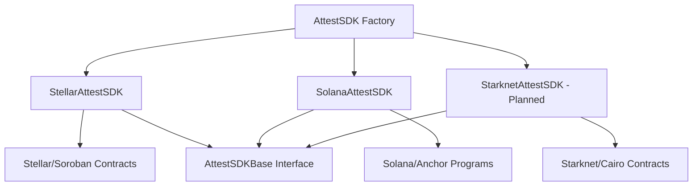

## Architecture

<Info>
The AttestProtocol TypeScript SDK implements a multi-chain abstraction layer using the Abstract Factory pattern. It provides a unified interface for blockchain-based attestation infrastructure while maintaining chain-specific optimizations.
</Info>



---

## Design Patterns

<Note>
These patterns ensure consistent behavior across all supported blockchains while maintaining flexibility for chain-specific optimizations.
</Note>

### Abstract Factory Pattern

Static factory methods create blockchain-specific instances.

```typescript
export class AttestSDK {
  static async initializeStellar(config: StellarConfig): Promise<StellarAttestSDK>
  static async initializeSolana(config: SolanaConfig): Promise<SolanaAttestSDK>
}
```

### Template Method Pattern

The `AttestSDKBase` abstract class defines the unified interface.

```typescript
export abstract class AttestSDKBase {
  abstract initialize(): Promise<void | AttestSDKResponse<void>>
  abstract fetchAuthority(): Promise<AttestSDKResponse<...>>
  abstract registerAuthority(): Promise<AttestSDKResponse<...>>
  abstract fetchSchema(schemaUID: ...): Promise<AttestSDKResponse<...>>
  abstract createSchema(config: ...): Promise<AttestSDKResponse<...>>
  abstract fetchAttestation(attestation: ...): Promise<AttestSDKResponse<...>>
  abstract attest(config: ...): Promise<AttestSDKResponse<...>>
  abstract revokeAttestation(props: ...): Promise<AttestSDKResponse<...>>
}
```

### Response Wrapper Pattern

Consistent error handling across all operations.

```typescript
export type AttestSDKResponse<T = undefined> =
  | { data: T; error?: undefined }
  | { data?: undefined; error: any }
```

---

## Chain Support

<Warning>
Starknet support is planned but not yet implemented. Current production support includes Stellar and Solana.
</Warning>

| Chain | Status | Implementation | Factory Method |
|-------|--------|----------------|----------------|
| **Stellar** | Active | `StellarAttestSDK` | `initializeStellar()` |
| **Solana** | Active | `SolanaAttestSDK` | `initializeSolana()` |
| **Starknet** | Planned | `StarknetAttestSDK` | `initializeStarknet()` |

### Chain-Specific Features

#### Stellar/Soroban
- **Contract System**: Protocol and Authority contracts
- **Transaction UIDs**: Schema UIDs are transaction hashes
- **Custom Signers**: Flexible wallet integration
- **Network**: Testnet only
- **Unique Features**: ScVal conversion, simulation-based reads

#### Solana/Anchor  
- **Program Architecture**: Single program with multiple instructions
- **PDA Management**: Program Derived Addresses for state
- **Token Support**: SPL token integration for levies
- **Networks**: Devnet, Testnet, Mainnet
- **Unique Features**: Cross-program invocations, rent exemption

---

## Module Structure

```
packages/sdk/src/
├── index.ts              # Factory class and exports
├── core/
│   ├── base.ts          # Abstract base class (51 lines)
│   ├── types.ts         # Type definitions (191 lines)
│   ├── stellar.ts       # Stellar implementation (771 lines)
│   ├── solana.ts        # Solana implementation (279 lines)
│   └── starknet.ts      # Placeholder (52 lines)
```

### Export Structure

```typescript
// Factory
export { AttestSDK }

// Chain implementations
export { StellarAttestSDK, SolanaAttestSDK }

// All types
export * from './core/types'
```

---

## Configuration Architecture

### Base Configuration

```typescript
interface ChainConfig {
  url?: string  // RPC endpoint
}
```

### Chain-Specific Extensions

```typescript
interface StellarConfig extends ChainConfig {
  secretKeyOrCustomSigner: string | StellarCustomSigner
  publicKey: string
}

interface SolanaConfig extends ChainConfig {
  walletOrSecretKey: number[] | anchor.Wallet
  programId?: string
}
```

---

## Performance Characteristics

### Network Operations

| Operation | Stellar | Solana | Description |
|-----------|---------|---------|-------------|
| Authority Registration | 1 tx | 1 tx | Creates authority record |
| Schema Creation | 1 tx | 1 tx | Registers new schema |
| Attestation Creation | 1 tx | 1 tx | Creates attestation |
| Attestation Fetch | 1 read | 1 read | Retrieves attestation data |
| Schema Fetch | 1-2 reads | 1 read | Gets schema definition |
| Revocation | 1 tx | 1 tx | Revokes attestation |

### Transaction Costs

**Stellar (XLM):**
- Base fee: ~0.00001 XLM per operation
- Contract execution: Additional compute costs
- Account reserves: ~2.5 XLM minimum balance

**Solana (SOL):**
- Transaction fee: ~0.000005 SOL
- Account rent: ~0.00203928 SOL per account
- Program execution: Additional compute units

---

## Security Model

### Key Management

```typescript
// Stellar - Flexible signing
interface StellarConfig {
  secretKeyOrCustomSigner: string | StellarCustomSigner
  publicKey: string
}

// Solana - Direct or wallet integration
interface SolanaConfig {
  walletOrSecretKey: number[] | anchor.Wallet
}
```

### Authority System

1. **Registration**: Wallets register as authorities
2. **Schema Creation**: Only authorities can create schemas
3. **Attestation**: Only authorities can issue attestations
4. **Revocation**: Only original attester can revoke
5. **Access Control**: Built-in authorization checks

---

## Error Handling

### Error Categories

```typescript
// Network-level errors
- Connection timeouts
- RPC endpoint failures
- Rate limiting

// Blockchain-specific errors
- Insufficient balance
- Invalid signatures
- Transaction failures

// Contract/Program errors
- Invalid parameters
- Authorization failures
- Contract execution errors
```

### Error Propagation

All methods return the consistent `AttestSDKResponse<T>` wrapper, eliminating the need for try-catch blocks in most cases.

---

## Build System

### Module Formats

| Format | Path | Usage |
|--------|------|-------|
| CommonJS | `dist/main/index.js` | Node.js |
| ES Modules | `dist/module/index.js` | Modern bundlers |
| UMD | `dist/umd/attestprotocol.js` | Browser/CDN |
| TypeScript | `dist/index.d.ts` | Type definitions |

### Tree Shaking

The SDK supports tree shaking, allowing bundlers to include only the blockchain implementations you use.

```typescript
// Only imports Stellar implementation
import { AttestSDK, StellarConfig } from '@attestprotocol/sdk';
```

---

## Extension Points

### Adding New Chains

1. Create implementation extending `AttestSDKBase`
2. Add chain-specific configuration interface
3. Implement all abstract methods
4. Add factory method to `AttestSDK`
5. Export types and implementation

```typescript
// Example implementation structure
export class NewChainAttestSDK extends AttestSDKBase {
  async initialize(): Promise<AttestSDKResponse<void>> {
    // Chain-specific initialization
  }
  
  // Implement all abstract methods
}
```

### Custom Implementations

The abstract base class enables custom implementations for specific use cases while maintaining interface compatibility.

---

## Contract Information

<CardGroup cols={2}>
  <Card title="Stellar Testnet" icon="circle-nodes">
    **Protocol Contract:**
    `CBPL7XR7NNPTNSIIFWQMWLSCX3B3MM36UYX4TW3QXJKTIEA6KDLRYAQP`
    
    **Authority Contract:**
    `CDQREK6BTPEVD4O56XR6TKLEEMNYTRJUG466J2ERNE5POIEKN2N6O7EL`
    
    **Network:**
    Soroban Testnet
  </Card>
  
  <Card title="Solana Devnet" icon="circle-nodes">
    **Program ID:**
    `BMr9aui54YuxtpBzWXiFNmnr2iH6etRu7rMFJnKxjtpY`
    
    **Network:**
    Solana Devnet
    
    **RPC Endpoint:**
    `https://api.devnet.solana.com`
  </Card>
</CardGroup>

---

## API Stability

- **Current Version**: 1.x - Stable API
- **Backward Compatibility**: Maintained within major versions
- **Breaking Changes**: Only in major version updates
- **Deprecation Process**: 6-month notice for API changes

---

## Integration Patterns

### Multi-Chain Applications

```typescript
interface SDKInstances {
  stellar?: StellarAttestSDK;
  solana?: SolanaAttestSDK;
}

async function initializeSDKs(): Promise<SDKInstances> {
  const sdks: SDKInstances = {};
  
  if (config.stellar) {
    sdks.stellar = await AttestSDK.initializeStellar(config.stellar);
  }
  
  if (config.solana) {
    sdks.solana = await AttestSDK.initializeSolana(config.solana);
  }
  
  return sdks;
}
```

### Framework Integration

The SDK integrates seamlessly with popular frameworks:

- **Express.js**: Server-side attestation APIs
- **React**: Client-side attestation interfaces
- **Next.js**: Full-stack attestation applications
- **Node.js**: Backend attestation services