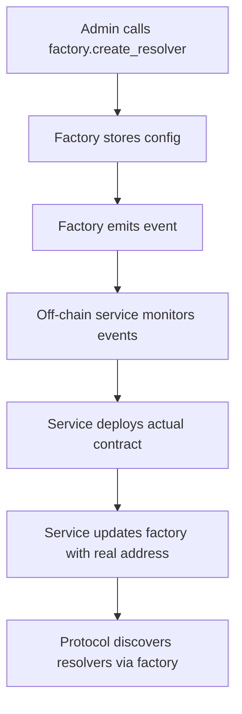

# Factory Pattern in Soroban - Learning Guide

## 🎯 **Learning Objectives**

This guide teaches you how to implement the **Factory Pattern** in Soroban smart contracts, specifically for creating an on-chain **configuration registry** for resolver instances. This pattern demonstrates how to manage resolver configurations in production environments where direct contract deployment from within contracts is not available.

## 🏗️ **What is the Factory Pattern in Soroban?**

The Factory Pattern in Soroban serves as a **configuration registry** rather than a direct deployment mechanism. It provides:

- **On-chain configuration storage** for resolver instances
- **Centralized discovery** of available resolvers
- **Configuration tracking** with lifecycle management
- **Event emission** for off-chain deployment coordination

**Key Insight**: In Soroban production contracts, you cannot directly deploy other contracts. The factory pattern works by storing configurations and emitting events for external deployment processes.

## 🔑 **Key Concepts**

### 1. **Configuration Registry vs Direct Deployment**

**Traditional Factory (Not Available in Soroban Production):**
```rust
// This doesn't work in production Soroban contracts
env.register_at(&address, MyContract {}, (param1, param2));
```

**Soroban Factory Pattern (Configuration Registry):**
```rust
// Store configuration, emit event for off-chain deployment
let config = ResolverConfig { /* ... */ };
env.storage().persistent().set(&config_key, &config);
env.events().publish(("RESOLVER_CONFIGURED", &address), &config);
```

### 2. **Instance Management**

The factory maintains a **registry** of all created instances:

```rust
pub struct ResolverInstance {
    pub address: Address,        // Where the contract is deployed
    pub config: ResolverConfig,  // Configuration parameters
    pub created_at: u64,         // Timestamp of creation
    pub is_active: bool,         // Current status
}
```

### 3. **Configuration Flexibility**

Each instance can have different parameters:

```rust
// Instance 1: USDC rewards
create_token_reward_resolver(usdc_token, 1000, "USDC Pool")

// Instance 2: XLM rewards  
create_token_reward_resolver(xlm_token, 500, "XLM Pool")

// Instance 3: Fee collection
create_fee_collection_resolver(fee_token, 100, "Fee Collector")
```

## 🚀 **Implementation Walkthrough**

### Step 1: Factory Contract Structure

```rust
#[contract]
pub struct ResolverFactory;

#[contractimpl]
impl ResolverFactory {
    // Core factory functions
    pub fn create_token_reward_resolver(...) -> Address
    pub fn create_fee_collection_resolver(...) -> Address
    
    // Management functions
    pub fn get_resolver_instances() -> Vec<ResolverInstance>
    pub fn deactivate_resolver(...) -> Result<(), Error>
    
    // Helper functions
    fn generate_resolver_address(&env) -> Address
    fn track_resolver_instance(...) -> Result<(), Error>
}
```

### Step 2: Address Generation Strategy

**Insights from `testutils::Address::generate()`:**

The Soroban SDK provides `Address::generate()` in test utilities (found at `soroban-sdk-22.0.8/src/address.rs:320-331`):

```rust
// From soroban SDK testutils
fn generate(env: &Env) -> Self {
    Self::try_from_val(
        env,
        &ScAddress::Contract(Hash(env.with_generator(|mut g| g.address()))),
    )
    .unwrap()
}
```

**Key Learnings:**
- `env.with_generator()` is only available in test mode
- `ScAddress` and `Hash` types aren't exposed for direct construction in production
- Address generation requires actual contract deployment

**Production Implementation:**
```rust
fn generate_resolver_address(env: &Env) -> Result<Address, ResolverError> {
    // In production, we use placeholder addresses
    // Real addresses come from actual contract deployment
    
    // For testing environments:
    #[cfg(test)]
    {
        use soroban_sdk::testutils::Address as TestAddress;
        return Ok(<Address as TestAddress>::generate(env));
    }
    
    // For production, return factory address as placeholder
    #[cfg(not(test))]
    {
        Ok(env.current_contract_address().clone())
    }
}
```

**Alternative Approaches:**
```rust
// Option 1: Accept specific addresses (for pre-deployed contracts)
pub fn create_token_reward_with_addr(
    env: Env,
    admin: Address,
    resolver_addr: Option<Address>, // If None, generates placeholder
    // ... other params
) -> Result<Address, ResolverError>

// Option 2: Use deployment scripts that provide addresses
// External process monitors events and deploys contracts
```

### Step 3: Configuration Registration (Not Direct Deployment)

```rust
pub fn create_token_reward_resolver(
    env: Env,
    admin: Address,
    reward_token: Address,
    reward_amount: i128,
    pool_name: String,
    pool_description: String,
) -> Result<Address, ResolverError> {
    Self::require_admin(&env, &admin)?;
    
    // 1. Generate or use provided address
    let resolver_address = Self::generate_resolver_address(&env)?;
    
    // 2. Create and store configuration (NOT deploy contract)
    let mut config_data = Map::new(&env);
    config_data.set(String::from_str(&env, "reward_token"), reward_token.to_string());
    config_data.set(String::from_str(&env, "reward_amount"), reward_amount_str);
    
    let config = ResolverConfig {
        resolver_type: ResolverType::TokenReward,
        name: pool_name.clone(),
        description: pool_description.clone(),
        admin: admin.clone(),
        config_data,
    };
    
    // 3. Track the configuration in factory registry
    Self::track_resolver_instance(&env, &resolver_address, &config)?;
    
    // 4. Emit event for off-chain deployment service
    env.events().publish(
        (String::from_str(&env, "TOKEN_REWARD_RESOLVER_CREATED"), &resolver_address),
        (config.name, reward_amount),
    );
    
    Ok(resolver_address)
}
```

**Key Differences from Traditional Factory:**
- ✅ **Stores configuration** instead of deploying contracts
- ✅ **Emits events** for external deployment coordination  
- ✅ **Tracks instances** for discovery and management
- ❌ **Does not deploy contracts directly** (not possible in Soroban production)

### Step 4: Instance Tracking

```rust
fn track_resolver_instance(
    env: &Env,
    resolver_address: &Address,
    config: &ResolverConfig,
) -> Result<(), ResolverError> {
    let count: u32 = env.storage().instance().get(&DataKey::ResolverCount).unwrap_or(0);
    
    let instance = ResolverInstance {
        address: resolver_address.clone(),
        config: config.clone(),
        created_at: env.ledger().timestamp(),
        is_active: true,
    };
    
    // Store in persistent storage
    let key = (DataKey::ResolverInstances, count);
    env.storage().persistent().set(&key, &instance);
    
    // Increment count
    env.storage().instance().set(&DataKey::ResolverCount, &(count + 1));
    
    Ok(())
}
```

## 💡 **Key Learning Points**

### 1. **Why Use Factory as Configuration Registry?**

- **Centralized Discovery**: All resolver configurations discoverable from one contract
- **Lifecycle Management**: Track active/inactive resolvers with metadata
- **Event-Driven Architecture**: Emit events for off-chain deployment coordination
- **Configuration Validation**: Ensure consistent resolver setup patterns
- **Admin Control**: Centralized permission management for resolver creation

**Production Deployment Flow:**
1. Factory stores configuration and emits event
2. Off-chain service monitors events
3. Service deploys actual resolver contracts 
4. Service updates factory with real addresses
5. Protocol uses factory for resolver discovery

### 2. **Address Generation Strategies**

```rust
// Strategy 1: Placeholder addresses (current implementation)
// Returns factory address, replaced by real addresses after deployment
fn generate_resolver_address(env: &Env) -> Address {
    env.current_contract_address().clone()
}

// Strategy 2: Accept pre-deployed addresses
pub fn create_token_reward_with_addr(
    env: Env,
    admin: Address,
    resolver_addr: Option<Address>, // Specific address if known
    // ... other params
) -> Result<Address, ResolverError>

// Strategy 3: External address provider service
// Off-chain service provides addresses before configuration storage

// Strategy 4: Test environments can use testutils
#[cfg(test)]
{
    use soroban_sdk::testutils::Address as TestAddress;
    <Address as TestAddress>::generate(env)
}
```

**Key Insight**: Address generation in production Soroban requires actual contract deployment, which cannot happen from within contracts. The factory pattern adapts by working with external deployment processes.

### 3. **Storage Management**

```rust
// Instance storage (persistent) - indexed access
DataKey::ResolverInstances + index -> ResolverInstance

// Configuration storage (persistent) - address lookup
DataKey::ResolverConfigs + address -> ResolverConfig

// Factory state (instance) - counters and admin
DataKey::Admin -> Address
DataKey::Initialized -> bool
DataKey::ResolverCount -> u32

// Note: NextAddressIndex removed since we use external deployment
```

**Storage Access Patterns:**
```rust
// Get all instances
for i in 0..count {
    let key = (DataKey::ResolverInstances, i);
    let instance: ResolverInstance = env.storage().persistent().get(&key)?;
}

// Get specific config by address
let key = (DataKey::ResolverConfigs, resolver_address);
let config: ResolverConfig = env.storage().persistent().get(&key)?;
```

### 4. **Lifecycle Management**

```rust
// Configuration registration (emits events for deployment)
factory.create_token_reward_resolver(...) -> Address
factory.create_fee_collection_resolver(...) -> Address

// With specific addresses (for pre-deployed contracts)
factory.create_token_reward_with_addr(addr: Option<Address>, ...) -> Address
factory.create_fee_resolver_with_addr(addr: Option<Address>, ...) -> Address

// Discovery and lookup
factory.get_resolver_instances() -> Vec<ResolverInstance>
factory.get_resolver_config(address) -> Option<ResolverConfig>

// Administrative functions
factory.initialize(admin) -> Result<(), Error>
factory.deactivate_resolver(admin, address) -> Result<(), Error>
```

**Lifecycle Flow:**
1. **Register**: Store configuration, emit event
2. **Deploy** (off-chain): Monitor events, deploy contracts
3. **Update** (optional): Factory updated with real addresses
4. **Discover**: Protocol queries factory for available resolvers
5. **Manage**: Admin can deactivate resolvers as needed

## 🎯 **Real-World Applications**

### 1. **Multiple Reward Pools**
```rust
// Different tokens for different attestation types
USDC Pool: KYC attestations -> 1000 USDC
XLM Pool: Credential attestations -> 500 XLM  
BLND Pool: Reputation attestations -> 2000 BLND
```

### 2. **Different Fee Structures**
```rust
// Different fee amounts for different services
Basic Fee: 100 XLM for standard attestations
Premium Fee: 500 XLM for expedited processing
Enterprise Fee: 1000 XLM for custom validation
```

### 3. **Schema-Specific Resolvers**
```rust
// Specialized resolvers for different business domains
KYCResolver: Identity verification logic
CredentialResolver: Educational credential validation
ReputationResolver: Social scoring algorithms
```

## 🔒 **Security Considerations**

### 1. **Access Control**
```rust
// Only factory admin can create new instances
fn require_admin(env: &Env, caller: &Address) -> Result<(), ResolverError> {
    caller.require_auth();
    let admin: Address = env.storage().instance().get(&DataKey::Admin)?;
    if caller != &admin { return Err(ResolverError::NotAuthorized); }
    Ok(())
}
```

### 2. **Address Collision Prevention**
```rust
// Ensure unique addresses for each instance
let index = get_next_index();
let address = generate_deterministic_address(factory_address, index);
increment_index();
```

### 3. **Instance Validation**
```rust
// Verify instance exists before operations
let config = get_resolver_config(address)?;
if !config.is_active { return Err(ResolverError::InactiveInstance); }
```

## 🧪 **Testing Strategy**

### 1. **Factory Initialization**
```rust
#[test]
fn test_factory_initialization() {
    let factory = deploy_factory();
    factory.initialize(admin);
    assert_eq!(factory.get_resolver_instances().len(), 0);
}
```

### 2. **Instance Creation with Specific Addresses**
```rust
#[test]
fn test_create_multiple_resolvers() {
    let factory = deploy_factory();
    
    // Generate unique addresses for testing
    let addr1 = Address::generate(&env);
    let addr2 = Address::generate(&env);
    
    let resolver1 = factory.create_token_reward_with_addr(
        &admin, &Some(addr1.clone()), &token, &1000, &name1, &desc1
    );
    let resolver2 = factory.create_fee_resolver_with_addr(
        &admin, &Some(addr2.clone()), &fee_token, &100, &recipient, &name2, &desc2
    );
    
    assert_eq!(resolver1, addr1); // Got requested address
    assert_eq!(resolver2, addr2); // Got requested address
    assert_ne!(resolver1, resolver2); // Different addresses
    assert_eq!(factory.get_resolver_instances().len(), 2);
}
```

### 3. **Configuration Management**
```rust
#[test]
fn test_resolver_config_retrieval() {
    let factory = deploy_factory();
    let resolver = factory.create_token_reward_resolver(...);
    
    let config = factory.get_resolver_config(&resolver);
    assert_eq!(config.resolver_type, ResolverType::TokenReward);
}
```

## 🔄 **Production Deployment Coordination**

### Off-chain Service Architecture

```typescript
// Example deployment service monitoring factory events
class ResolverDeploymentService {
    async monitorFactoryEvents() {
        const events = await stellar.getContractEvents(factoryAddress, {
            filters: ['TOKEN_REWARD_RESOLVER_CREATED', 'FEE_COLLECTION_RESOLVER_CREATED']
        });
        
        for (const event of events) {
            await this.deployResolver(event);
        }
    }
    
    async deployResolver(event: ContractEvent) {
        const { resolver_address, config } = event.data;
        
        // 1. Deploy actual resolver contract
        const deployedAddress = await this.deploySorobanContract(
            resolverWasm,
            config.initParams
        );
        
        // 2. Optionally update factory with real address
        await factoryContract.update_resolver_address(
            resolver_address,
            deployedAddress
        );
    }
}
```

### Event-Driven Deployment Flow



## 🚀 **Next Steps**

1. **Deploy the Factory**: Create the configuration registry contract
2. **Build Deployment Service**: Implement off-chain coordination service
3. **Integrate with Protocol**: Update protocol to discover resolvers via factory
4. **Add More Resolver Types**: Extend factory to support new resolver implementations
5. **Implement Advanced Features**: Add batch operations, upgrade mechanisms, etc.

### Implementation Checklist

- [ ] Deploy factory contract with admin setup
- [ ] Create deployment monitoring service
- [ ] Implement resolver WASM deployment automation
- [ ] Add factory integration to main protocol
- [ ] Set up event monitoring and alerting
- [ ] Test end-to-end resolver creation flow

## 📚 **Additional Resources**

- [Soroban Documentation](https://soroban.stellar.org/)
- [Factory Pattern in Solidity](https://docs.openzeppelin.com/contracts/4.x/api/proxy#Clones)
- [Stellar Soroban Examples](https://github.com/stellar/soroban-examples)

---

This factory pattern implementation provides a powerful foundation for creating scalable, manageable resolver ecosystems in your attestation protocol! 